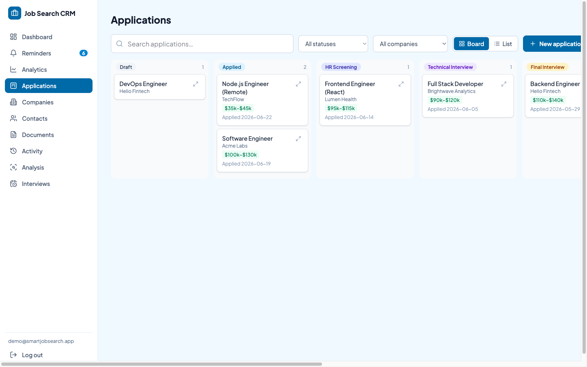
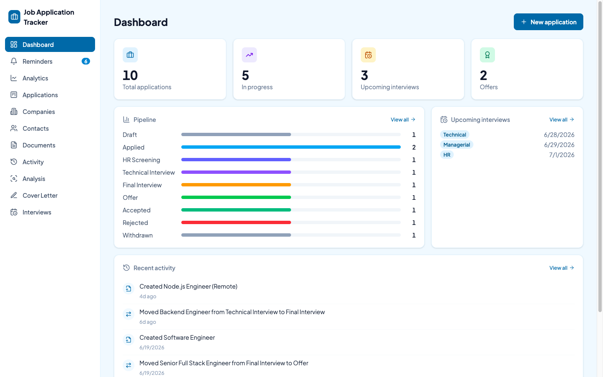
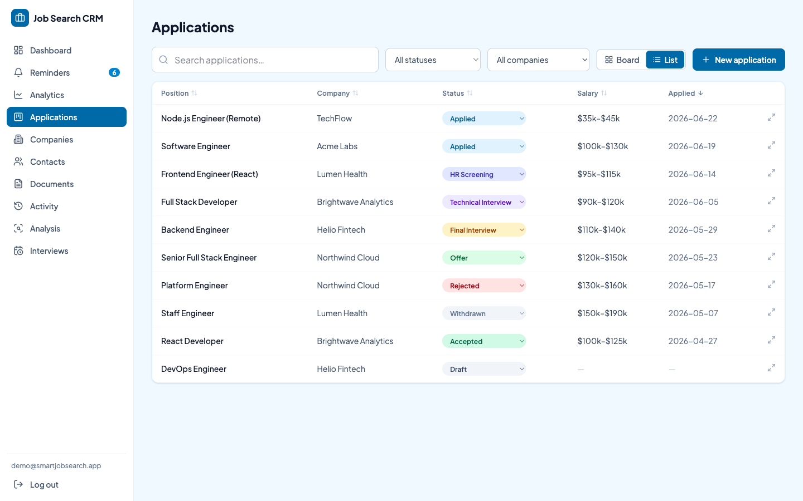
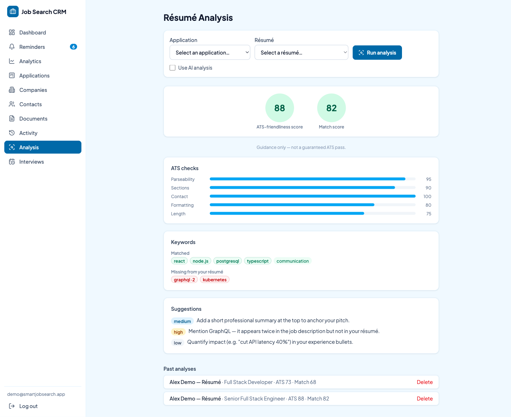
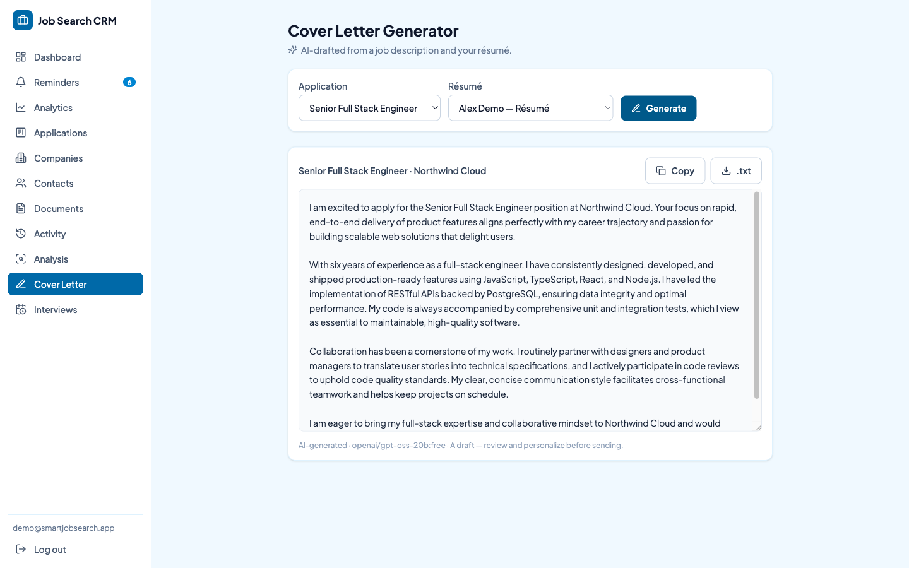
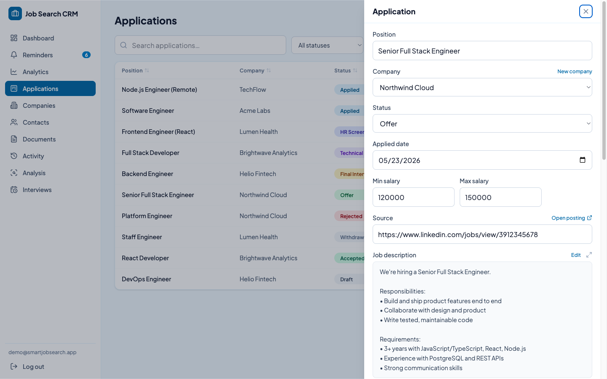
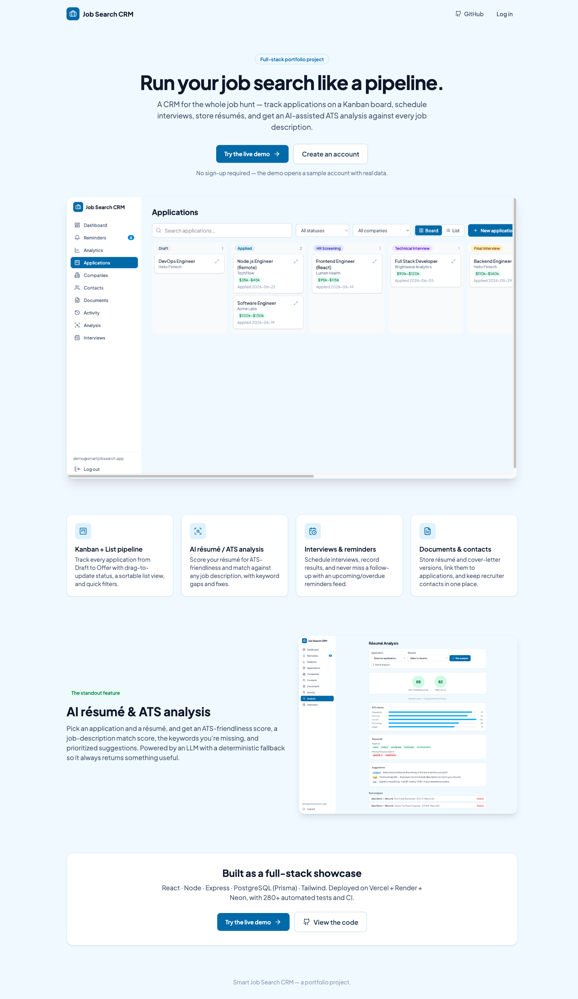
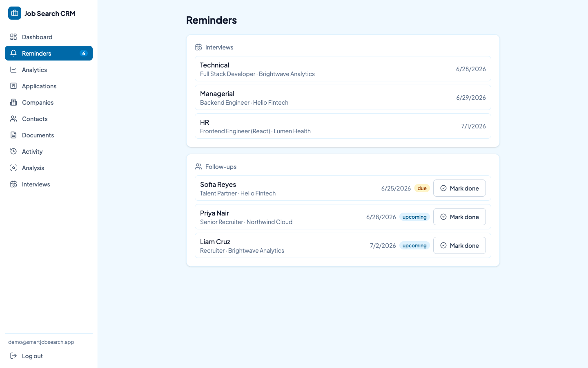
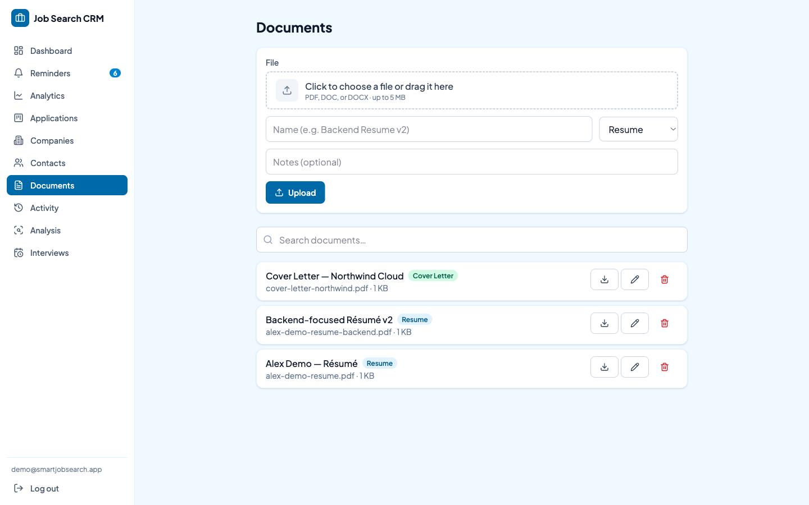

# JobTrail

A full-stack CRM for managing a job search end to end — track applications across a Kanban pipeline, schedule interviews, keep notes on companies and contacts, store résumés, and get an **AI-assisted résumé/ATS analysis** against each job description.

[](https://github.com/AngeloCP-01/SmartJobSearch-FE/actions/workflows/ci.yml)
&nbsp;**[▶ Live demo](https://jobtrail-hq.vercel.app)** — click **“Try the demo”** (no sign-up).

> Two repos: **frontend** (this) and the **[API backend](https://github.com/AngeloCP-01/SmartJobSearch-BE)**.



---

## Highlights

- **Kanban + List views** of applications with drag-to-update status (optimistic, with rollback), inline status quick-change, sortable columns, status/company filters, and a Remote/Hybrid/On-site **work-mode** chip.
- **AI résumé/ATS analysis** — scores a résumé for ATS-friendliness and match against a job description, with keyword gaps and prioritized, actionable suggestions. Runs on an LLM (OpenRouter) with a graceful deterministic fallback.
- **AI cover-letter generator** — drafts a tailored cover letter from a job description + your résumé, editable inline and exportable. Reuses the same model-fallback resilience as the analysis engine.
- **Job-posting auto-import** — paste a posting (text or a URL) and AI fills the new-application form: position, company, salary, and description.
- **The full job-search workflow** — companies, contacts, interviews (with results), a reminders feed (upcoming/overdue), document storage, and a per-application activity timeline.
- **Production-grade plumbing** — in-memory access token + httpOnly refresh cookie with single-flight refresh, app-wide loading feedback, accessible components, and **280+ automated tests** across both repos.

## Screenshots

| Dashboard | Applications (List) |
|---|---|
|  |  |

| AI Résumé Analysis | AI Cover Letter |
|---|---|
|  |  |

| Application detail | Landing page |
|---|---|
|  |  |

| Reminders | Documents |
|---|---|
|  |  |

## Tech stack

| | |
|---|---|
| **Frontend** | React + Vite · React Router · TanStack Query · Tailwind CSS v4 · @dnd-kit · Recharts · lucide-react |
| **Backend** | Node.js · Express · PostgreSQL (Prisma) · JWT (access + refresh cookie) · Zod · OpenRouter (AI) |
| **Tests** | Vitest + RTL + MSW (frontend) · Jest + Supertest (backend) — 280+ tests |
| **Infra** | Vercel (web) · Render (API) · Neon (Postgres) · Supabase Storage (uploads) · GitHub Actions (CI + keep-alive) |

## Architecture

```
Browser ─▶ Vercel (React SPA) ──VITE_API_URL──▶ Render (Express API) ──▶ Neon (Postgres)
                                                      └── S3 driver ──▶ Supabase Storage (résumés)
   in-memory access token + SameSite=None httpOnly refresh cookie
```

The API is a **modular monolith** (one module per domain: auth, companies, applications, interviews, contacts, documents, activity, analysis…), each with its own routes/controller/service/schema and integration tests.

## Engineering highlights

- **Optimistic Kanban moves** — dragging a card updates the cache immediately and rolls back on error; the mutation logic is extracted as a pure function and unit-tested independently of pointer events.
- **Resilient auth** — concurrent 401s share a single `/auth/refresh` call (single-flight) to avoid racing refresh-token rotation; a server 5xx never force-logs-you-out.
- **AI with a safety net** — résumé analysis tries a chain of LLM models, fast-fails on rate limits to the next model, and falls back to a deterministic keyword matcher so the feature never hard-fails.
- **Swappable storage** — a small `save/createReadStream/remove` interface backs both local disk (dev) and S3-compatible object storage (prod) so uploads survive the host’s ephemeral disk; selected by one env var, no caller changes.
- **Pragmatic deploy** — runs entirely on free tiers; a keep-alive workflow pings the API so a reviewer never hits a cold start.

## Run it locally

Requires Node 20+ and the [backend](https://github.com/AngeloCP-01/SmartJobSearch-BE) running at `http://localhost:4000`.

```bash
npm install
cp .env.example .env      # VITE_API_URL=http://localhost:4000/api
npm run dev               # http://localhost:5173
```

## Tests

```bash
npm test                  # Vitest — backend mocked at the network layer with MSW
npm run build             # production build
```

## Project docs

- [`DESIGN.md`](./DESIGN.md) — design system (typography, palette, component conventions)
- [`TRACKER.md`](./TRACKER.md) / [`TASKS.md`](./TASKS.md) — milestone + change log
- Deployment walkthrough lives in the [backend repo’s `DEPLOY.md`](https://github.com/AngeloCP-01/SmartJobSearch-BE/blob/main/DEPLOY.md)
