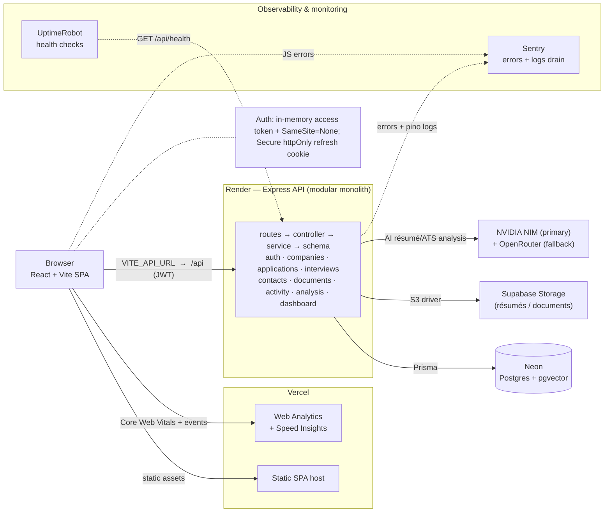

# JobTrail

A full-stack CRM for managing a job search end to end — track applications across a Kanban pipeline, schedule interviews, keep notes on companies and contacts, store résumés, get an **AI-assisted résumé/ATS analysis** against each job description, generate cover letters, get **RAG-grounded résumé-tailoring suggestions**, and edit documents in a built-in rich-text editor.

[](https://github.com/AngeloCP-01/SmartJobSearch-FE/actions/workflows/ci.yml)
&nbsp;**[▶ Live demo](https://jobtrail-hq.vercel.app)** — click **“Try the demo”** (no sign-up).

> Two repos: **frontend** (this) and the **[API backend](https://github.com/AngeloCP-01/SmartJobSearch-BE)**.


---

## Highlights

- **Kanban + List views** of applications with drag-to-update status (optimistic, with rollback), inline status quick-change, sortable columns, status/company filters, and a Remote/Hybrid/On-site **work-mode** chip.
- **AI résumé/ATS analysis** — scores a résumé for ATS-friendliness and match against a job description, with keyword gaps and prioritized, actionable suggestions. Runs on an LLM (NVIDIA NIM, with OpenRouter as fallback) and degrades gracefully to a deterministic matcher.
- **AI cover-letter generator** — drafts a tailored cover letter from a job description + your résumé, editable inline and exportable. Reuses the same model-fallback resilience as the analysis engine.
- **Tailor Résumé (RAG-grounded)** — pick an application + résumé and get concrete emphasize/rephrase/remove suggestions grounded in your own documents (pgvector retrieval), never invented. A **"Draft in Editor"** button opens your résumé verbatim in the editor with a click-to-locate suggestions panel.
- **In-app rich-text editor** — a TipTap-based document editor (headings, tables, images, find/replace, page layout, print/PDF) with autosave; open uploaded PDFs/DOCX/Markdown or a generated cover letter straight into it.
- **Job-posting auto-import** — paste a posting (text or a URL) and AI fills the new-application form: position, company, salary, and description.
- **The full job-search workflow** — companies, contacts, interviews (with results), a reminders feed (upcoming/overdue), document storage, and a per-application activity timeline.
- **Production-grade plumbing** — in-memory access token + httpOnly refresh cookie with single-flight refresh, app-wide loading feedback, accessible components, full **observability** (Sentry error tracking, structured logging, uptime + Core Web Vitals monitoring), and **~580 automated tests** across both repos.

## Screenshots

| Dashboard | Applications (List) |
|---|---|
|  |  |

| AI Résumé Analysis | AI Cover Letter |
|---|---|
|  |  |

| Application detail | Landing page |
|---|---|
|  |  |

| Reminders | Documents |
|---|---|
|  |  |

## Tech stack

| | |
|---|---|
| **Frontend** | React + Vite · React Router · TanStack Query · Tailwind CSS v4 · @dnd-kit · Recharts · lucide-react · TipTap (editor) |
| **Backend** | Node.js · Express · PostgreSQL (Prisma) · JWT (access + refresh cookie) · Zod · NVIDIA NIM / OpenRouter (AI) · pgvector (RAG) |
| **Tests** | Vitest + RTL + MSW (frontend) · Jest + Supertest (backend) — ~580 tests (~297 frontend · ~285 backend) |
| **Hosting** | **Vercel** (frontend SPA) · **Render** (Express API) |
| **Data & storage** | **Neon** (serverless Postgres) · **Supabase Storage** (S3-compatible object storage for résumés/documents) |
| **AI** | **NVIDIA NIM** (primary — chat + RAG embeddings) · **OpenRouter** (fallback) — one multi-provider engine, model chain spans both |
| **Observability** | **Sentry** (errors — `@sentry/react` FE + `@sentry/node` BE) · **pino** structured logging → Sentry Logs drain · **Vercel Web Analytics** + **Speed Insights** (Core Web Vitals) · **UptimeRobot** (health-check monitoring) |
| **CI/CD** | **GitHub Actions** — Vitest + Playwright e2e (FE) · Jest + Supertest (BE) · keep-alive ping to beat Render cold starts |

## Deployment & infrastructure

Everything runs on **free tiers**, chosen to demonstrate a production-shaped setup without ongoing cost.

| Concern | Service | What it does here |
|---|---|---|
| **Frontend host** | Vercel | Serves the Vite SPA (static assets + SPA rewrite). Deploys on push to `main`. |
| ↳ on Vercel | Web Analytics | Cookieless page-view traffic + two custom product events (`ai_analysis_run`, `application_created`). |
| ↳ on Vercel | Speed Insights | Core Web Vitals (LCP, CLS, INP) from real sessions, with `/editor/:id` normalized to `/editor/[id]`. |
| **Backend host** | Render | Runs the Express API. `/api/health` kept warm by a GitHub Actions keep-alive ping. |
| **Database** | Neon | Serverless Postgres (via Prisma), including `pgvector` for RAG résumé-tailoring retrieval. |
| **File storage** | Supabase Storage | S3-compatible bucket for uploaded résumés/documents, via the `@aws-sdk/client-s3` driver — survives Render's ephemeral disk. |
| **AI (LLM)** | NVIDIA NIM · OpenRouter | Powers analysis, cover letters, tailoring, and posting auto-fill. A multi-provider engine routes each model in the chain by an `nvidia:`/`openrouter:` prefix; the live chain is all-NVIDIA NIM (`integrate.api.nvidia.com`, ~3–6s), with OpenRouter as a fallback pool. Falls back to a deterministic keyword matcher if every provider fails. |
| **AI (embeddings)** | NVIDIA NIM | `nv-embedqa-e5-v5` embeddings for the pgvector RAG retrieval behind résumé tailoring. |
| **Error tracking** | Sentry | Frontend (`@sentry/react` + ErrorBoundary + source maps) and backend (`@sentry/node`); auth headers scrubbed before send. |
| **Logging** | pino → Sentry Logs | Structured backend logs, drained to Sentry Logs (Render's native drains are paywalled). |
| **Uptime monitoring** | UptimeRobot | HTTP(s) monitor on the backend health endpoint. |

## Architecture



The API is a **modular monolith** (one module per domain: auth, companies, applications, interviews, contacts, documents, activity, analysis…), each with its own routes/controller/service/schema and integration tests.

## Engineering highlights

- **Optimistic Kanban moves** — dragging a card updates the cache immediately and rolls back on error; the mutation logic is extracted as a pure function and unit-tested independently of pointer events.
- **Resilient auth** — concurrent 401s share a single `/auth/refresh` call (single-flight) to avoid racing refresh-token rotation; a server 5xx never force-logs-you-out.
- **AI with a safety net** — a single multi-provider engine routes each model in the chain to its provider (`nvidia:` → NVIDIA NIM, else OpenRouter), fast-fails on rate limits to the next model, honors `Retry-After`, and falls back to a deterministic keyword matcher so the feature never hard-fails. The live chain runs on NVIDIA NIM (fast, reliable) after the OpenRouter free tier proved flaky.
- **Swappable storage** — a small `save/createReadStream/remove` interface backs both local disk (dev) and S3-compatible object storage (prod) so uploads survive the host’s ephemeral disk; selected by one env var, no caller changes.
- **Pragmatic deploy** — runs entirely on free tiers; a keep-alive workflow pings the API so a reviewer never hits a cold start.
- **Observability, not just deployment** — errors surface in Sentry (frontend + backend, auth headers scrubbed), backend logs are structured with pino and drained to Sentry Logs, UptimeRobot watches the health endpoint, and Vercel Web Analytics + Speed Insights track real-user traffic and Core Web Vitals.

## Run it locally

Requires Node 20+ and the [backend](https://github.com/AngeloCP-01/SmartJobSearch-BE) running at `http://localhost:4000`.

```bash
npm install
cp .env.example .env      # VITE_API_URL=http://localhost:4000/api
npm run dev               # http://localhost:5173
```

## Tests

```bash
npm test                  # Vitest — backend mocked at the network layer with MSW
npm run build             # production build
```

## Project docs

- [`DESIGN.md`](./DESIGN.md) — design system (typography, palette, component conventions)
- [`TRACKER.md`](./TRACKER.md) / [`TASKS.md`](./TASKS.md) — milestone + change log
- Deployment walkthrough lives in the [backend repo’s `DEPLOY.md`](https://github.com/AngeloCP-01/SmartJobSearch-BE/blob/main/DEPLOY.md)
